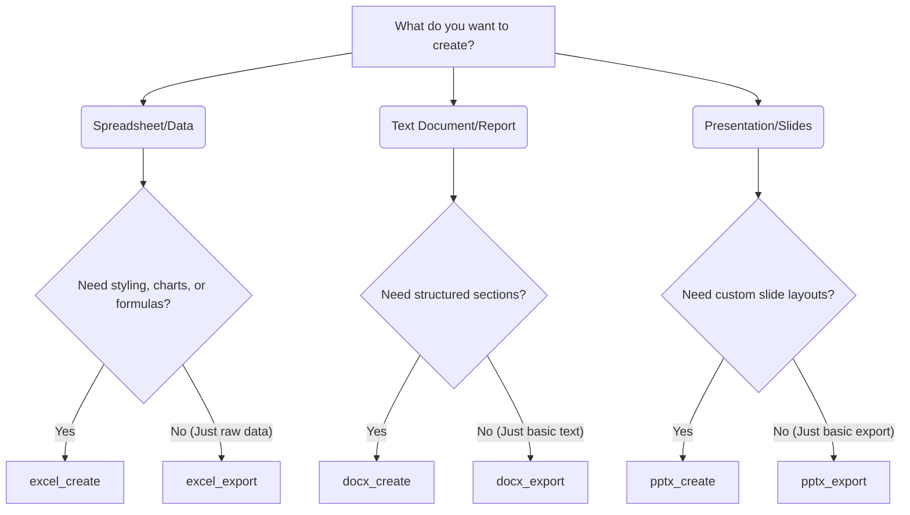

# MCP Office Server Tool Guide

This guide provides detailed instructions on how to use the MCP Office Server tools effectively. It is designed to help AI agents and developers generate high-quality documents while avoiding common pitfalls.

## Tool Selection Flowchart



---

## 1. excel_create

Creates an Excel workbook (.xlsx) with multiple sheets, styling, charts, and formulas.

### When to Use
- You need to create workbooks from structured data.
- You want to include charts or Excel formulas.
- You need professional themed styling applied automatically.
- You want to base a new document on an existing template.

### When NOT to Use
- You only have raw CSV/JSON data and just want a simple export without styling → use `excel_export`.
- You want to modify an existing file without using it as a template (direct modification is not supported yet).

### Constraints
- **Max Sheets:** 50
- **Max Rows:** 1,048,576 per sheet
- **Max Columns:** 16,384 per sheet
- **Sheet Name:** Max 31 characters

### Common Mistakes
- ❌ **String numbers:** `["100", "200"]` instead of `[100, 200]`. Always use actual numeric types for numbers.
- ❌ **Using both `sheets` and `template_path`:** These are mutually exclusive.
- ❌ **Missing '=' prefix for formulas:** `"SUM(A1:A5)"` instead of `"=SUM(A1:A5)"`.
- ❌ **Mismatched row lengths:** A row with 3 items when headers have 4 items. Every row must exactly match the length of the headers array.

### Full Working JSON Example
```json
{
  "filename": "sales.xlsx",
  "theme": "corporate",
  "sheets": [
    {
      "name": "Q1",
      "headers": ["Month", "Revenue", "Expenses"],
      "rows": [
        ["Jan", 50000, 30000],
        ["Feb", 62000, 35000],
        ["Mar", 58000, 32000]
      ],
      "charts": [
        {
          "chart_type": "bar",
          "data_range": "A1:C4",
          "title": "Q1 Performance",
          "position": "E2"
        }
      ]
    }
  ]
}
```

### Troubleshooting
- **Error: "Row has 3 columns, expected 4"**: Make sure every array inside `rows` has exactly the same number of elements as the `headers` array. Fill missing values with empty strings `""` or `null`.
- **Error: "Formula missing '=' prefix"**: Ensure that any cell you want evaluated as a formula explicitly starts with `=`.

---

## 2. docx_create

Creates a Word document (.docx) using a structured array of sections.

### When to Use
- You need to generate rich documents with titles, TOCs, headings, paragraphs, lists, and tables.
- You want the document to follow a consistent theme.

### When NOT to Use
- You just want to dump a block of plain text → use `docx_export`.

### Constraints
- **Max Pages:** 500
- **Max Table Rows:** 10,000

### Common Mistakes
- ❌ **Passing raw text strings:** Do not use `content_paragraphs` (deprecated). Always use the `sections` array with proper `type` definitions.
- ❌ **Using unsupported section types:** Always stick to the enum: `title`, `subtitle`, `toc`, `heading_1`, `heading_2`, `heading_3`, `paragraph`, `list_bullet`, `list_number`, `table`.

### Full Working JSON Example
```json
{
  "filename": "quarterly_report.docx",
  "theme": "minimal",
  "sections": [
    {"type": "title", "text": "Quarterly Report"},
    {"type": "toc"},
    {"type": "heading_1", "text": "1. Revenue Analysis"},
    {"type": "paragraph", "text": "Revenue grew by 12% year-over-year."},
    {"type": "list_bullet", "items": ["SaaS: +15%", "Services: +8%"]},
    {"type": "table", "headers": ["Region", "Revenue"], "rows": [["APAC", "$2.1M"], ["EMEA", "$1.8M"]]}
  ]
}
```

### Troubleshooting
- **TOC not updating:** The Table of Contents is generated using Word field codes. When you open the document in MS Word, you may need to right-click the TOC area and select "Update Field" to populate the page numbers.

---

## 3. pptx_create

Creates a PowerPoint presentation (.pptx).

### When to Use
- You need to generate slides with specific layouts (titles, content, bullet points, tables).
- You want to apply corporate themes and branding.

### When NOT to Use
- You just want to export some basic text slides without layout control → use `pptx_export`.

### Constraints
- **Max Slides:** 500

### Common Mistakes
- ❌ **Using invalid layouts:** Allowed layouts are `title`, `title_and_content`, `title_only`, `two_content`, `blank`, `section_header`, `comparison`.
- ❌ **Mismatched table headers and rows:** Similar to Excel, if you provide `table_headers` on a slide, `table_rows` must match the column count exactly.

### Full Working JSON Example
```json
{
  "filename": "deck.pptx",
  "theme": "dark",
  "slide_size": "widescreen",
  "slides": [
    {
      "title": "Welcome",
      "layout": "title"
    },
    {
      "title": "Q1 Performance",
      "content": "Overall performance was strong.",
      "bullets": ["Revenue exceeded targets", "Costs were minimized"],
      "layout": "title_and_content"
    }
  ]
}
```

### Troubleshooting
- **Layout looks wrong:** Make sure you are using a layout that matches the data you provided. For example, if you provide `bullets`, use `title_and_content` or `two_content`.

---

## 4. Export Tools (excel_export, docx_export, pptx_export)

These tools are designed for quick, un-styled data dumps or multi-format conversions.

### When to Use
- You need to export raw data quickly.
- You need to generate open document formats (ODF) like `.ods`, `.odt`, or `.odp`.
- You want to export to multiple formats simultaneously (e.g., `format: "all"`).

### Constraints
- Same size and dimension limits as their `_create` counterparts.

### Full Working JSON Example (excel_export)
```json
{
  "format": "csv",
  "sheets": [
    {
      "name": "Data Dump",
      "headers": ["ID", "Name"],
      "rows": [[1, "Alice"], [2, "Bob"]]
    }
  ]
}
```
